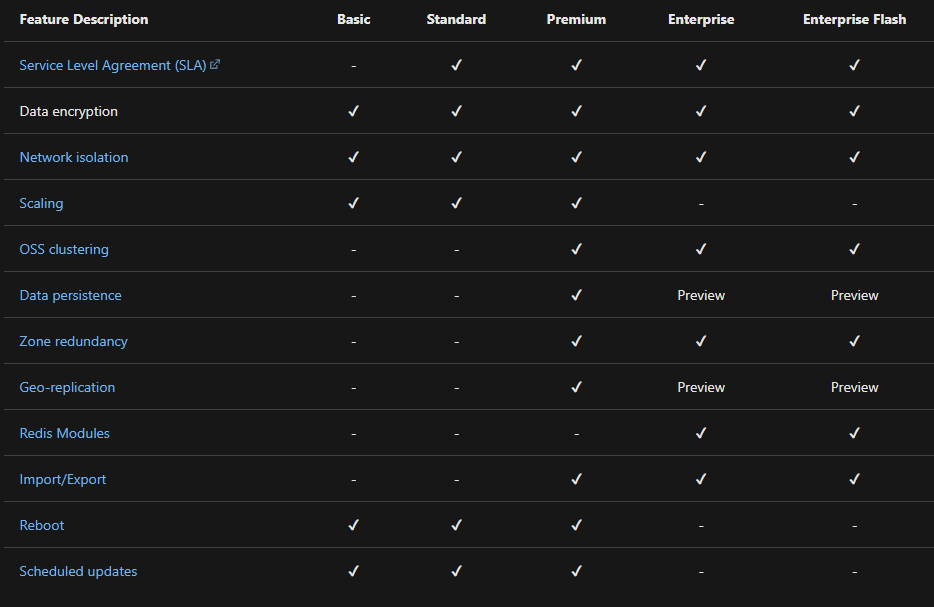

# Azure Redis Cache
* [Overview](concepts/overview.md)
* Features
    * [SLA](concepts/arc-sla.md)
    * [Encryption](concepts/arc-encryption.md)
    * [Network isolation](concepts/arc-network-isolation.md)

### Feature comparison between different tiers
Refer [link](https://docs.microsoft.com/en-us/azure/azure-cache-for-redis/cache-overview#feature-comparison)
